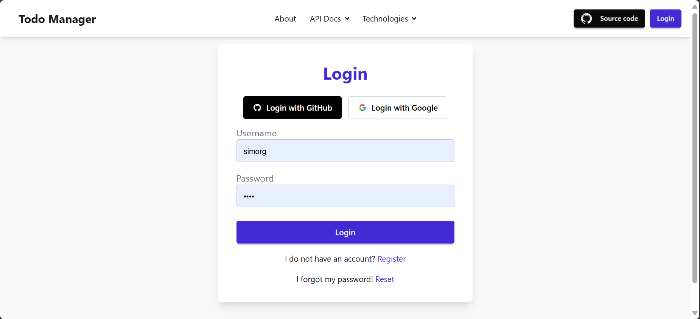

# 📝 ToDo Manager – API & Interactive UI

A clean, secure, and dynamic ToDo Management App built with **Django**, **Django REST Framework**, **HTMX**, and **TailwindCSS (DaisyUI)**.  
It supports both a fully-documented RESTful API and an interactive web UI without heavy JavaScript.

---

## 📸 Project Preview

### Dashboard


### Modals


### Authentcation



---

## 🚀 Features

### ✅ Backend API (DRF + JWT)
- Register / Login via JWT
- Create / Read / Update / Delete your tasks
- Tasks are user-specific (private per user)
- Filtering, searching, ordering support
- Swagger / ReDoc auto documentation

### 🌐 Frontend UI (HTMX + TailwindCSS)
- Dynamic task list
- Modal for create / update tasks
- Built using **HTMX + Django Partials**
- Fully responsive with **DaisyUI design**

---

## 🧰 Tech Stack

| Layer         | Tools Used                                 |
|---------------|---------------------------------------------|
| Backend       | Django 5.2.3, Django REST Framework          |
| Auth          | Simple JWT (Access/Refresh tokens)          |
| API Docs      | drf-spectacular (OpenAPI/Swagger/ReDoc)     |
| UI Framework  | Django Templates + HTMX                     |
| CSS Styling   | TailwindCSS + DaisyUI                       |
| Filtering     | django-filter                               |

---

## 📦 Installation

```bash
# 1. Clone repo
git clone https://github.com/alanhasn/Task-manager-using-Django-HTMX-and-DRF
cd Task-manager-using-Django-HTMX-and-DRF

# 2. Create virtual env
python -m venv venv
source venv/bin/activate  # Windows: venv\Scripts\activate

# 3. Install dependencies
pip install -r requirements.txt

# 4. Apply migrations
python manage.py migrate

# 5. Run server
python manage.py runserver
````

---

## 🔐 Authentication (JWT)

### ✅ Register

`POST /api/register/`

```json
{
  "username": "mohammed doe",
  "email": "doela@example.com",
  "password": "StrongPassword123"
}
```

### 🔑 Login

`POST /api/login/`

```json
{
  "username": "mohammed doe",
  "password": "StrongPassword123"
}
```

### 🔄 Refresh Token

`POST /api/token/refresh/`

```json
{
  "refresh": "<your_refresh_token>"
}
```

---

## 📚 API Documentation


### Access the API documentation at:
* Swagger UI → [http://127.0.0.1:8000/api/schema/swagger-ui/](http://127.0.0.1:8000/api/schema/swagger-ui)
* Redoc → [http://127.0.0.1:8000/api/schema/redoc/](http://127.0.0.1:8000/api/schema/redoc)
* Schema YML → [http://127.0.0.1:8000/api/schema/](http://127.0.0.1:8000/api/schema)

---

## 🧪 API Endpoints

| Method | Endpoint         | Description                            | Auth |
| ------ | ---------------- | -------------------------------------- | ---- |
| GET    | /api/todos/      | List current user’s todos              | ✅    |
| POST   | /api/todos/      | Create a new todo                      | ✅    |
| GET    | /api/todos/{id}/ | Retrieve a specific todo               | ✅    |
| PUT    | /api/todos/{id}/ | Update a todo                          | ✅    |
| DELETE | /api/todos/{id}/ | Delete a todo                          | ✅    |
| GET    | /api/users/      | Get authenticated user + related todos | ✅    |

---

## 🔍 Filtering, Searching, Ordering


| Feature    | Example                                  |
| ---------- | ---------------------------------------- |
| Filter     | `/api/todos/?completed=true`             |
| Date Range | `/api/todos/?created_at__gte=2024-01-01` |
| Search     | `/api/todos/?search=meeting`             |
| Order      | `/api/todos/?ordering=-updated_at`       |

---

## 🌐 Frontend (HTMX UI)

### 💻 Key UI Pages

| Page                | Description                                               |
| ------------------- |-----------------------------------------------------------|
| 🔐 Login / Register | Forms for Session authentication ,  login and registration |
| 🏠 Dashboard        | List of tasks for logged-in user                          |
| 🆕 Create Task      | Form to add new task using `hx-post`                      |
| 📝 Update Task      | Inline or modal form using `hx-post`          |
| ❌ Delete Task       | Deletion via `hx-delete` with confirmation                |
---

### ⚙️ HTMX Interactions Used

* `hx-get` → Load dynamic content (e.g. task table)
* `hx-post` → Create task
* `hx-delete` → Delete task
* `hx-target`, `hx-swap` → Update DOM elements
* `hx-trigger` → triggers like `load`, `submit`, `change`

---

## 🧩 Best Practices Followed

* Separation of API & UI logic
* Modularized app using `todo/api/`
* DRY templates using `partials/`
* Auth-protected views and endpoints
* Password validation with strong rules
* HTMX + Django used progressively (no JS frameworks)

---

## 🧑‍💻 Author

* 👤 Developed by: **@alanhasn**
* 📅 first Issue Closed: `June 29, 2025`
* 📌 Project Repository:
  [https://github.com/alanhasn/Task-manager-using-Django-HTMX-and-DRF](https://github.com/alanhasn/Task-manager-using-Django-HTMX-and-DRF)

---

## 📃 License

This project is licensed under the MIT License.
See `LICENSE` file for more details.
